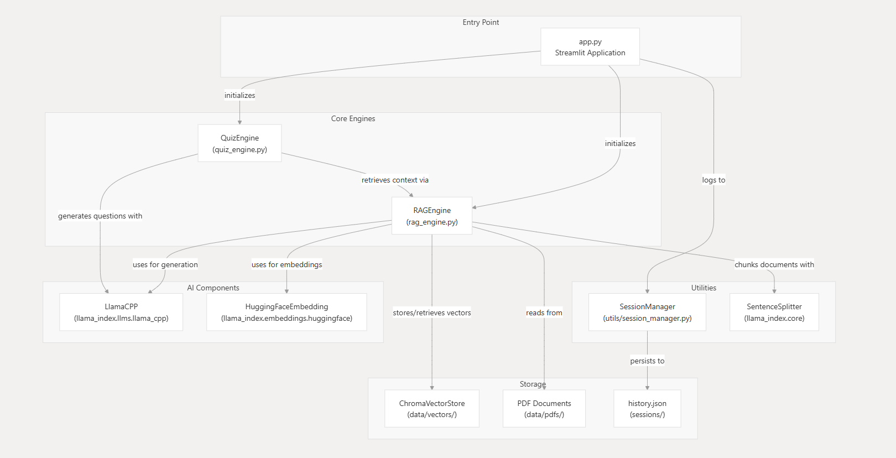
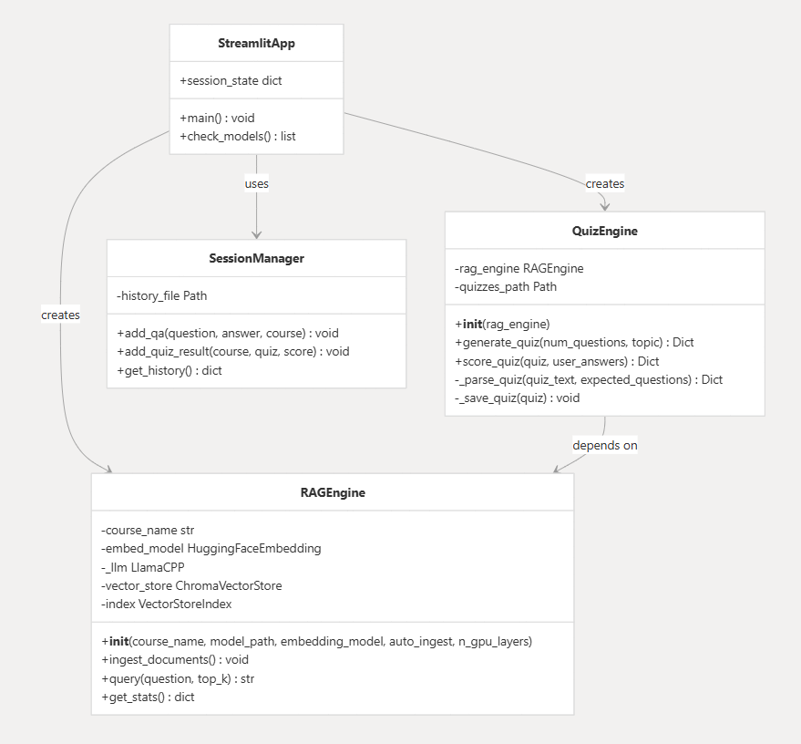
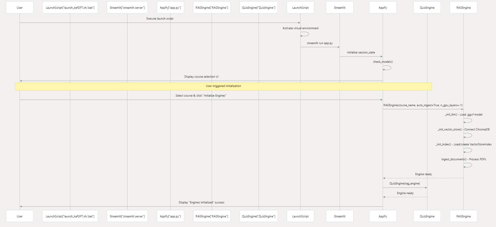

# kefGPT

a lightweight, offline, quiz-generating learning assistant for students

kefGPT is a minimal, modular RAG system designed to help students learn from their course materials. It works 100% offline with no API keys or internet dependencies

## features

- 📚 **multi-course support**: organize materials by course with separate vector collections
- 💬 **ask questions**: chat with your course materials using local LLM
- 📝 **quiz generation**: automatically generate multiple-choice questions from your documents
- 📊 **quiz scoring**: take quizzes and see your results with explanations
- 📜 **session history**: track your Q&A and quiz results
- 🔒 **100% offline**: no API keys, no internet required after initial setup
- 🎯 **lightweight**: minimal dependencies, optimized for local execution

## requirements

- python 3.11+
- a local LLM model in `.gguf` format (e.g., Mistral-7B-Instruct, Llama 2, etc)
- ~4GB RAM minimum (8GB+ recommended)
- GPU optional but recommended for faster inference

## installation

1. **clone or download KefGPT**

2. **install dependencies:**
   ```bash
   pip install -r requirements.txt
   ```

3. **download a local LLM model:**
   - download a `.gguf` model file (e.g., from [HuggingFace](https://huggingface.co/models?search=gguf))
   - place it in `models/llm_models/`
   - recommended: `Qwen3-1.7B-Q8_0.gguf` or similar

4. **set up your course structure:**
   ```
   data/
     pdfs/
       course_name_1/
         document1.pdf
         document2.pdf
       course_name_2/
         document1.pdf
   ```

## usage

1. **start the application:**
   ```bash
   streamlit run app.py
   ```

2. **in the sidebar:**
   - select a course from the dropdown
   - click "Initialize Engines" to load models and ingest documents
   - wait for initialization to complete

3. **ask questions:**
   - go to the "Ask KefGPT" tab
   - type your question about the course materials
   - get answers based on your documents

4. **generate quizzes:**
   - go to the "Quiz Mode" tab
   - set number of questions and optional topic
   - click "Generate Quiz"
   - answer the questions and submit to see your score

## PS!
if you are on windows, use `launch_kefGPT.bat`

if you are on linux, use `launch_kefGPT.sh`

if you are on mac, use `launch_kefGPT.sh`

## folder structure

```
kefGPT/
├── app.py                 # main streamlit application
├── rag_engine.py          # RAG engine for document querying
├── quiz_engine.py          # quiz generation and scoring
├── requirements.txt       # python dependencies
├── utils/
│   ├── session_manager.py # Q&A and quiz history
│   └── text_splitter.py   # text processing utilities
├── data/
│   ├── pdfs/             # course PDFs organized by course
│   └── vectors/           # vector database storage (auto-created)
├── models/
│   ├── llm_models/       # place your .gguf models here
│   └── embeddings/       # embedding model cache (auto-created)
└── sessions/
    ├── history.json      # Q&A and quiz history (auto-created)
    └── quizzes/          # generated quiz files (auto-created)
```

## configuration

### LLM model
- place your `.gguf` model file in `models/llm_models/`
- the first `.gguf` file found will be used automatically
- recommended models: Mistral-7B-Instruct, Llama 2 7B, or GPT4All models

### embedding model
- default: `sentence-transformers/all-MiniLM-L6-v2` (384 dimensions)
- will be downloaded automatically on first use
- can be changed in `rag_engine.py`

### vector database
- uses ChromaDB (local, persistent)
- each course gets its own collection
- stored in `data/vectors/{course_name}/`

## troubleshooting

### "Model not found" error
- ensure your `.gguf` model is in `models/llm_models/`
- check that the file has the `.gguf` extension

### slow performance
- use a quantized model (Q4_K_M or Q5_K_M)
- reduce `max_new_tokens` in `rag_engine.py`
- use GPU if available (requires CUDA setup)

### memory errors
- use a smaller model (7B instead of 13B+)
- reduce `chunk_size` in document processing
- close other applications

### embedding download issues
- first run requires internet to download embedding model
- after download, works fully offline
- model cached in `models/embeddings/`

## system architecture


## class-level components map


## workflow


## limitations

- PDF parsing quality depends on PDF structure
- quiz generation quality depends on LLM model size
- large documents may take time to process
- first-time embedding model download requires internet

## license

this project is based on PrivateGPT but has been significantly simplified and refactored for educational use

## contributing

this is a minimal implementation. feel free to fork and customize for your needs!

## support

for issues or questions, check:
- model compatibility: ensure your model is in `.gguf` format
- python version: requires Python 3.11+
- dependencies: run `pip install -r requirements.txt`

---

**note**: kefGPT is designed for educational purposes. ensure you have rights to use the course materials you're processing